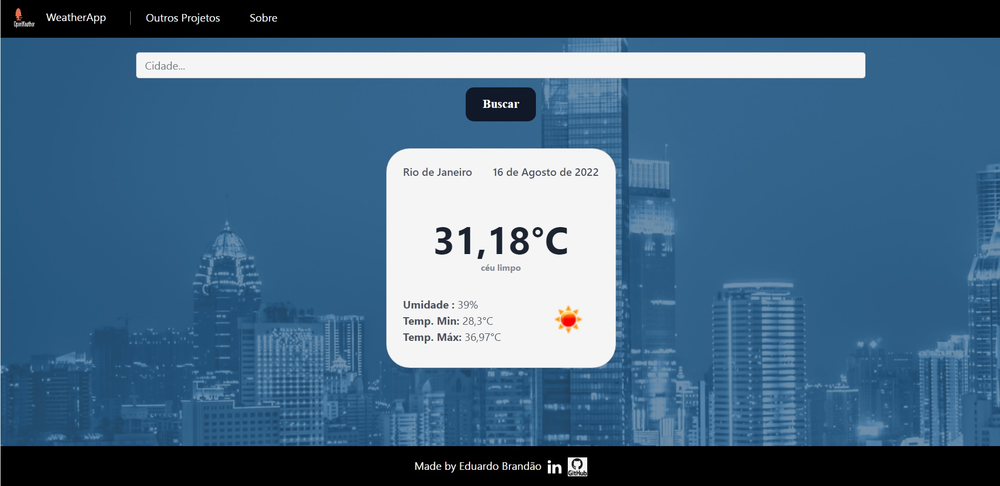

# App WeatherApp
Este repositório trata-se da versão 1.0 de uma aplicação web para detalhar a temperatura e clima de uma cidade, buscando os dados através 
da api externa no openweather.

# APRESENTACAO
Construir uma aplicação web para que o usuário seja capaz de:
- Visualizar o layout da pagina independente do tamanho da tela do dispositivo;
- Visualizar os dados climáticos da cidade;
- Pesquisar através do nome uma cidade específica;
- Visualizar outros projetos criados na seção 'Outros Projetos';
- Encaminhar e-mail com sugestões e/ou críticas através da seção 'Sobre';

# METODOLOGIA
Aplicação de conceitos em:
- Python
- Django
- HTML;
- CSS;
- Bootstrap;
- Layouts Responsivos.
- Api externa

# SCREENSHOT DO PROJETO

# LINK DO PROJETO
Para visualizar o projeto no seu navegador utilize o link abaixo:

https://appweatherdjango.herokuapp.com
